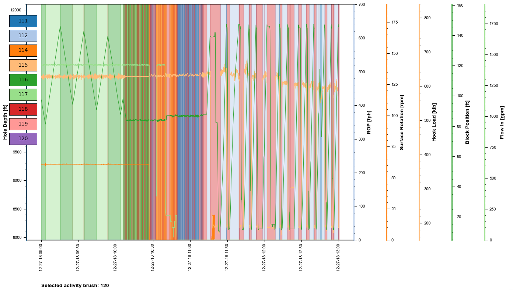
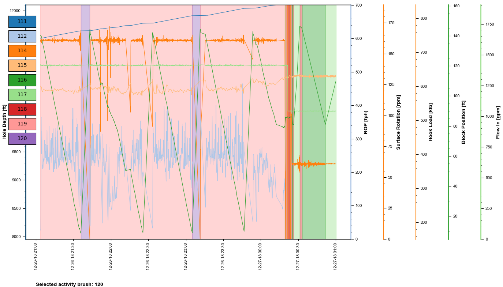
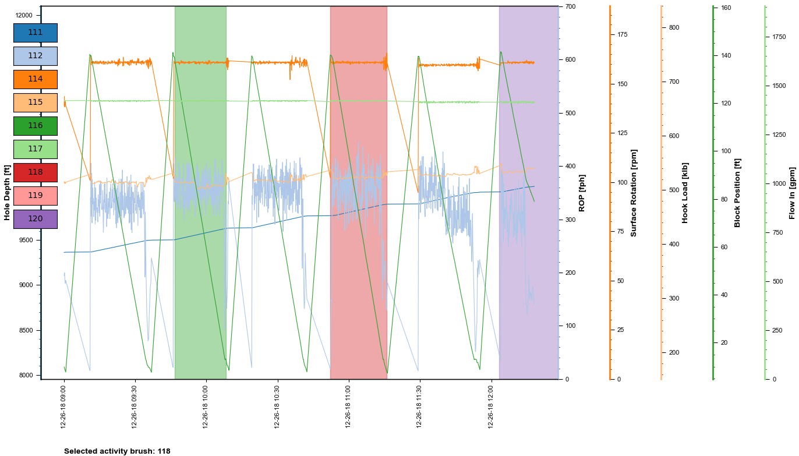

# Annotation (Labeling) of Multivariate Time Series Data
<strong>Abraham C. Montes</strong>  
<a href="https://www.linkedin.com/in/abraham-c-montes-6661a841/">LinkedIn</a>|<a href="https://www.abraham-montes.com/">Personal Site</a> 
The University of Texas at Austin | <a href="https://drilling.utexas.edu/">RAPID research consortium</a>
-------------------------------
This repo contains a tool for annotating (labeling) time-series data. The primary purpose is to facilitate the tedious process of manual labeling by using (1) a pre-annotation custom logic, and (2) interactive plots that allow visual annotation of the time series.   
The annotated TS data can then be used to train time-series classifiers.
Access AnnotationNotebook.ipynb for a step-by-step guide.   
Sample annotations:  

